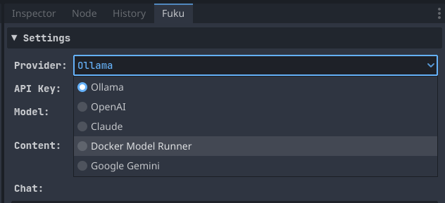
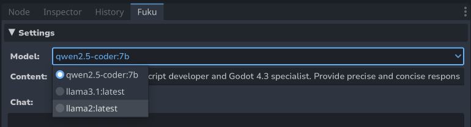
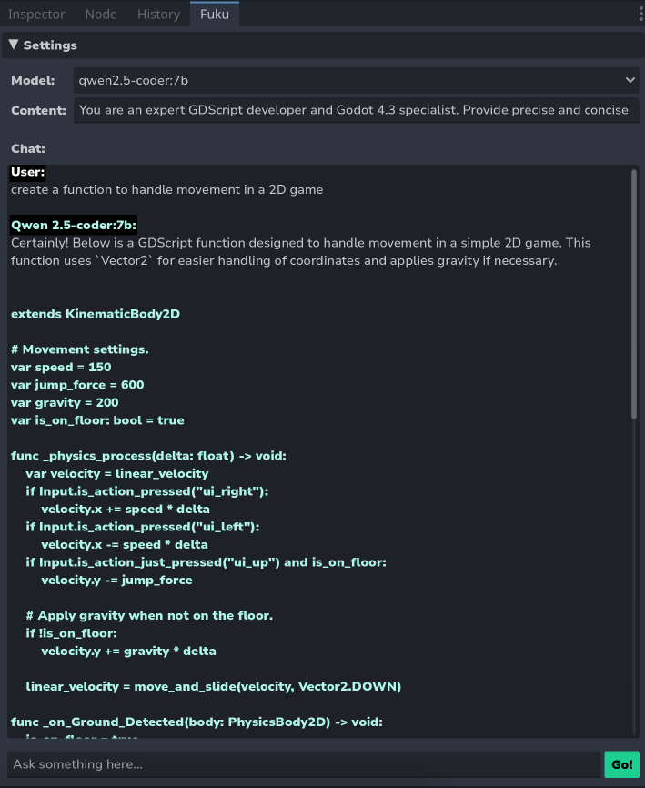
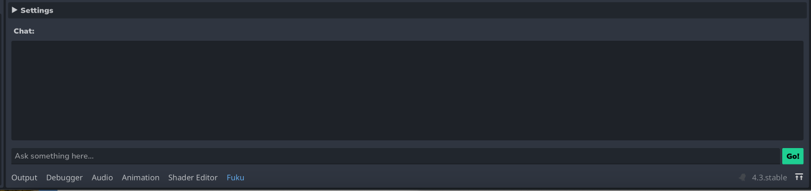

  

# Fuku - AI Assistant for Godot

Fuku is a plugin for [Godot Engine](https://godotengine.org/) that integrates multiple AI providers, enabling you to interact with powerful LLMs (large language models) directly in your editor.

## Features

- 🤖 **Multi-Provider Support**: Works with Ollama, OpenAI, Claude, Gemini, and DMR (Docker Model Runner)
- 💬 **Intelligent Chatbot**: Get context-aware assistance for Godot 4.5 development
- 🔧 **Customizable**: Adjust system instructions and switch between models easily

## ⚠️ Prerequisites

Depending on your chosen provider:

- **Ollama**: Install [Ollama](https://ollama.ai) and download models locally
- **Docker Model Runner**: Install [Docker Desktop](https://www.docker.com/products/docker-desktop/) with Model Runner enabled
- **OpenAI/Claude/Gemini**: Obtain an API key from the respective provider

## Installation

To install the plugin in your Godot project:

1. [Download⬇](https://github.com/af009/fuku/releases/latest) the latest release
2. Extract the `addons/` folder to your Godot project directory
3. In the Godot editor, navigate to `Project` > `Project Settings` > `Plugins`
4. Find "Fuku" and click the "Enable" button

The plugin will appear on the right side panel next to the history tab.

## Usage

### Getting Started

1. **Select a Provider** from the dropdown:

   

2. **Configure API Key** (if required):
    - Ollama and Docker Model Runner don't require API keys
    - For OpenAI, Claude, or Gemini: enter your API key and optionally check "Save" to store it

    
3. **Click Connect** to fetch available models

4. **Select a Model** from the dropdown:

   

5. **(Optional)** Customize the system instructions for the AI

6. **Start chatting!**

   

### Supported Providers

| Provider | API Key Required | Local/Cloud | Notes |
|----------|-----------------|-------------|-------|
| **Ollama** | ❌ No | Local | Run models locally on your machine |
| **OpenAI** | ✅ Yes | Cloud | GPT-4, GPT-3.5-turbo, etc. |
| **Claude** | ✅ Yes | Cloud | Claude Opus, Sonnet, Haiku |
| **Gemini** | ✅ Yes | Cloud | Gemini 2.5 Flash/Pro, 1.5 Flash/Pro |
| **Docker Model Runner** | ❌ No | Local | Run models via Docker Desktop |

### Customizing Panel Location (Optional)

By default, Fuku appears in the right dock panel. To move it to the bottom panel:

1. Select the Fuku plugin in `Project` > `Project Settings` > `Plugins`
2. In the Inspector, enable the "Use Bottom Panel" checkbox
3. Restart the plugin to apply changes

## API Key Security

- API keys can be optionally saved to `addons/fuku/.env` (base64 encoded)
- The `.env` file is **not encrypted** - add it to `.gitignore` to prevent accidental commits
- You are responsible for the security of stored API keys
- API keys can also be entered per-session without saving

## What's New in v1.1.0

- ✅ Multi-provider support (OpenAI, Claude, Gemini, Docker)
- ✅ Performance optimizations with RegEx caching
- ✅ Godot 4.5 best practices compliance

## License

This plugin is released under the [MIT License](LICENSE).

## Support

If you encounter any issues or have questions about the plugin:
- Open an issue on the [GitHub repository](https://github.com/af009/fuku/issues)
- Check existing issues for solutions

## Contributing

Contributions are welcome! Feel free to submit pull requests or open issues for bugs and feature requests.