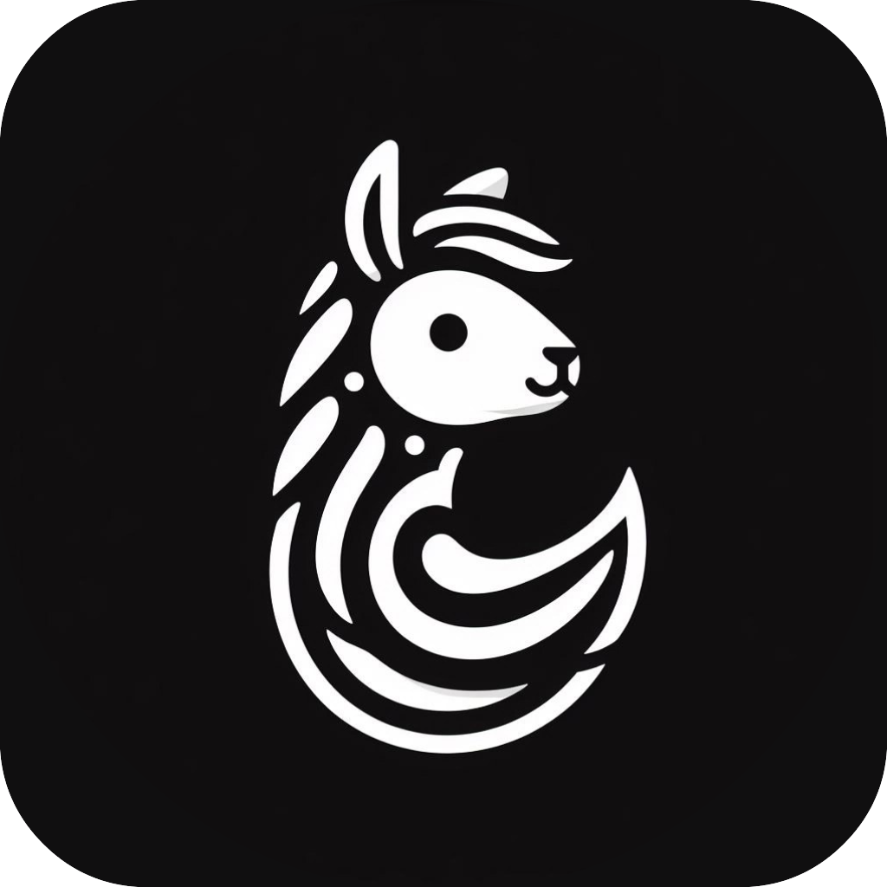
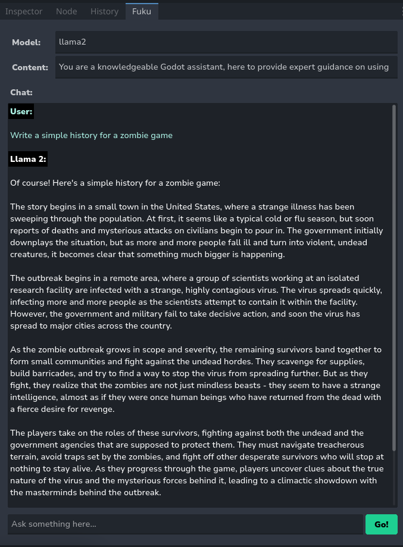

  

# Fuku - Ollama Integration for Godot

Fuku is a plugin for [Godot Engine](https://godotengine.org/) that integrates [Ollama](https://ollama.ai), enabling you to interact with your own LLMs (large language models).

## Features

- 🤖 **Chatbot**: Ask something into the chat box and the LLM will generate a relevant response!

- 🚀 **Upcoming**: Code completion, full history chat.

## ⚠️ Prerequisites

Before using Fuku, make sure you have installed and running [Ollama](https://ollama.ai) with one of the available models on your machine.

## Installation

To install the plugin in your Godot project, follow these simple steps:

1. [Download⬇](https://github.com/af009/fuku/releases/download/v1.0.1-3/fuku.zip) the `addons/` folder.
2. Move the `addons/` folder to your Godot project directory.
3. In the Godot editor, navigate to `Project` > `Project Settings` > `Plugins`.
4. Click the "Enable" button.

You should now see the plugin listed on the right side next to the history tab.

## Usage

By default, Fuku is pre-configured to use the `llama2` model with a default content (instruction). However, you can easily customize it to use any installed model or/and provide your own instructions.

To interact with Fuku, follow these steps:

1. Select the Fuku tab in the editor interface.
2. (Optional) Set a different model by modifying the "Model" field.
3. (Optional) Customize the content instruction for the model.
4. Start chatting!

## License

This plugin is released under the [MIT License](LICENSE).

## Support

If you encounter any issues or have questions about the plugin, please open an issue on this repository.
