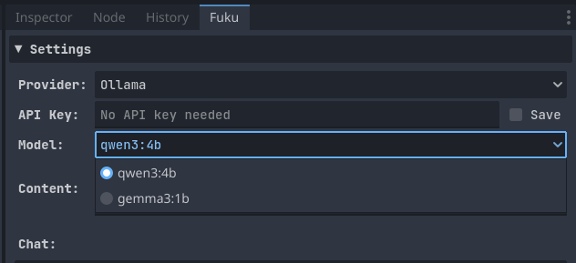
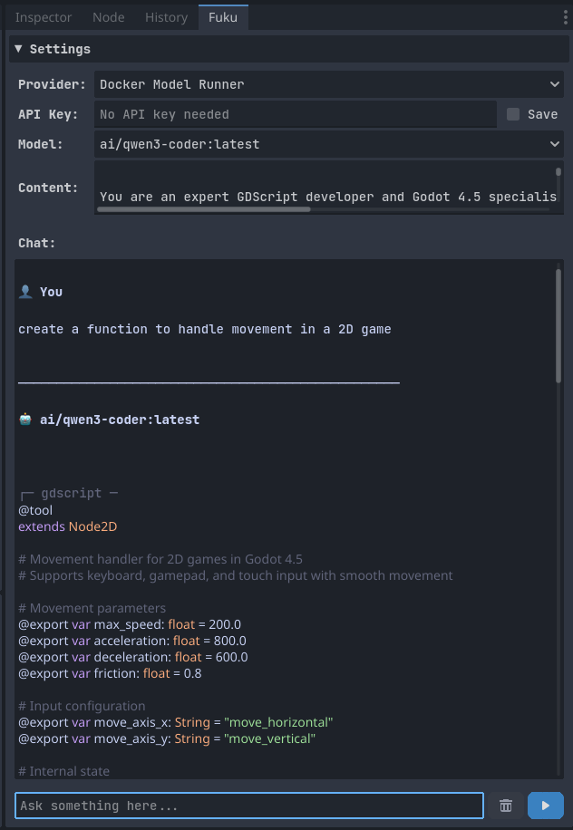
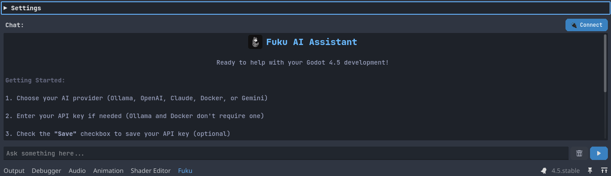

  

# Fuku - Ollama Integration for Godot

Fuku is a plugin for [Godot Engine](https://godotengine.org/) that integrates [Ollama](https://ollama.ai), enabling you to interact with your own LLMs (large language models).

## Features

- 🤖 **Chatbot**: Ask something into the chat box and the LLM will generate a relevant response!

- 🚀 **Upcoming**: Code completion, full history chat.

## ⚠️ Prerequisites

Before using Fuku, make sure you have installed and running [Ollama](https://ollama.ai) with one of the available models on your machine.

## Installation

To install the plugin in your Godot project, follow these simple steps:

1. [Download⬇](https://github.com/af009/fuku/releases/download/v1.0.4-7/fuku.zip) the `addons/` folder.
2. Move the `addons/` folder to your Godot project directory.
3. In the Godot editor, navigate to `Project` > `Project Settings` > `Plugins`.
4. Click the "Enable" button.

You should now see the plugin listed on the right side next to the history tab.

## Usage

Fuku comes pre-configured with default content (instructions), but you can easily customize it to use any installed model and provide your own instructions.

### Interacting with Fuku

1. Open the Fuku tab in the Godot editor interface.
2. Select a Model:

   
3. (Optional) Customize the content instructions for the model.
4. Start chatting!

   

### Customizing Fuku's Location (Optional)

By default, the Fuku tab is located in the Dock panel next to the History tab. To move it to the bottom panel:

1. Open `addons/fuku/fuku.gd`.
2. Set the `USE_BOTTOM_PANEL` constant to `true`:
   ` const USE_BOTTOM_PANEL := true`
3. Restart the plugin to apply changes.

 

## License

This plugin is released under the [MIT License](LICENSE).

## Support

If you encounter any issues or have questions about the plugin, please open an issue on this repository.
